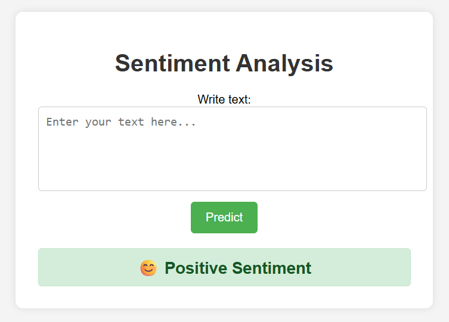

# 🧠 Sentiment Analysis MLOps Project

## 📋 Project Overview
This project demonstrates a **complete MLOps pipeline** for a Sentiment Analysis application that classifies text as **Positive** or **Negative** sentiment.  
The end-to-end solution covers data processing, model training, experiment tracking, containerization, CI/CD automation, cloud deployment, and monitoring using AWS EKS.



---

## 🧠 Tech Stack & Tools Used

### 🏗️ Core Technologies
- **Programming Language:** Python 3.10  
- **Frameworks:** Flask, Scikit-learn, MLflow  
- **Version Control:** Git, GitHub  
- **Experiment Tracking:** MLflow (via DagsHub)  
- **Data & Model Versioning:** DVC (Data Version Control)  
- **Containerization:** Docker  
- **Cloud Platform:** AWS (ECR, EKS, S3, IAM)  
- **CI/CD Pipeline:** GitHub Actions  
- **Monitoring & Visualization:** Prometheus & Grafana  

### ⚙️ Python Libraries
`numpy`, `pandas`, `scikit-learn`, `mlflow`, `dagshub`, `flask`, `nltk`, `boto3`, `yaml`, `pickle`, `prometheus-client`

---

## 📊 Model Performance

| Metric     | Score |
|-------------|-------|
| **Accuracy** | 85%  |
| **Precision** | 90%  |
| **Recall** | 72%  |
| **F1-Score** | 80%  |

---

## 🔄 Complete MLOps Workflow

### **1️⃣ Data & Model Lifecycle Management**
- Data ingestion from AWS S3 handled via modular scripts (`src/data_ops/`).
- Preprocessing, feature engineering (BoW), and sentiment encoding.
- Model training (Logistic Regression) & evaluation tracked in **MLflow** via **DagsHub**.
- Parameters maintained in `params.yaml`; pipeline orchestrated via `dvc.yaml`.

### **2️⃣ CI/CD Pipeline (GitHub Actions)**
- **Automated Testing:** Unit tests for data pipeline and Flask endpoints.  
- **Build & Push:** Docker image pushed to **AWS ECR**.  
- **Deploy:** Application deployed automatically to **EKS** cluster.  
- **Environment Variables:** Managed securely via GitHub Secrets.

### **3️⃣ Deployment (AWS EKS)**
- Scalable Kubernetes-managed cluster hosts the Flask application.  
- **AWS LoadBalancer** exposes the web service externally.  
- Rolling updates ensure **zero downtime** during redeployments.

### **4️⃣ Monitoring (Prometheus + Grafana)**
- Custom metrics (`REQUEST_COUNT`, `REQUEST_LATENCY`, `PREDICTION_COUNT`) exposed at `/metrics`.  
- **Prometheus** scrapes metrics from EKS LoadBalancer endpoint.  
- **Grafana** visualizes live dashboards for model and system health.

---

## 🧭 ML System Architecture & Flow Chart

```mermaid
flowchart TD

A[User Input - Flask UI] --> B[Text Preprocessing (NLTK)]
B --> C[Vectorization (CountVectorizer)]
C --> D[Model Prediction (Logistic Regression)]
D --> E[Display Result on UI]

subgraph Backend Infrastructure
    F[MLflow - Experiment Tracking]
    G[DVC - Data & Model Versioning]
    H[AWS S3 - Remote Storage]
    I[AWS ECR - Docker Image Registry]
    J[AWS EKS - Deployment Cluster]
    K[Prometheus - Metrics Collector]
    L[Grafana - Dashboard Visualization]
end

D -->|Model Performance Logs| F
C -->|Processed Data| G
G -->|Store Files| H
DockerImage --> I
I --> J
J -->|Expose /metrics| K --> L

---

## 🛠️ Setup & Run Instructions

### 🔹 Local Environment Setup
```bash
conda create -n atlas python=3.10
conda activate atlas
pip install -r requirements.txt

🔹 Run Pipeline Locally
dvc repro

🔹 Launch Flask App Locally
cd flask_app
python app.py

🔹 Build Docker Image
docker build -t sentiment-app:latest .
docker run -p 5000:5000 -e CAPSTONE_TEST=<your_dagshub_token> sentiment-app:latest

🔹 Deploy to AWS EKS
eksctl create cluster --name flask-app-cluster --region us-east-1 --node-type t3.small --nodes 1 --managed
kubectl apply -f deployment.yaml
kubectl get svc flask-app-service


Once the LoadBalancer URL is available, access your app at:

http://<external-ip>:5000

📊 Prometheus & Grafana Integration

Prometheus: Scrapes metrics from
http://<external-ip>:5000/metrics

Grafana: Connects to the Prometheus data source (http://<prometheus-ip>:9090)
and visualizes real-time dashboards for latency, request count, and prediction metrics.

🧩 Key Learnings & Highlights

✅ Implemented modular and scalable MLOps architecture
✅ Built CI/CD pipelines with automated testing, build, and deployment
✅ Integrated MLflow + DVC for experiment reproducibility
✅ Deployed containerized app using Docker & Kubernetes (EKS)
✅ Added Monitoring & Observability with Prometheus and Grafana
✅ Strengthened understanding of cloud orchestration & DevOps workflows

👨‍💻 Author

Dushyant Verma
M.Tech, IIT Bhubaneswar | Data Scientist | MLOps Enthusiast